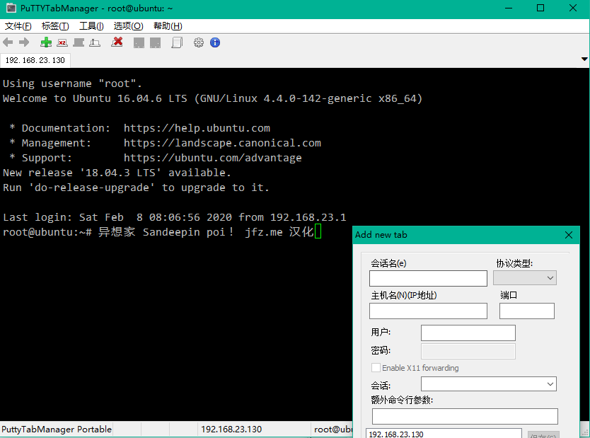

# PuTTYTabManager-zh_CN
PuTTY Tab Manager(puttytm) V0.52 zh_CN 简体中文汉化版

### 功能

Putty是一款小巧好用免费的SSH客户端工具，但是不支持多标签管理，网上找了一些相关的putty多标签包装软件，最后觉得PuTTY Tab Manager最好用，支持单独在自己的配置中保存会话信息，而且他的一个标签“附着”能力非常有意思，不仅可以将putty集成进来，还支持KiTTY、MinTTY等其它软件嵌入它的标签中。

官方网站：https://sites.google.com/site/macdsite/utilidades/puttytabmanager

### 截图

### 更新日志

#### 2020-02-09

* 启动汉化。
